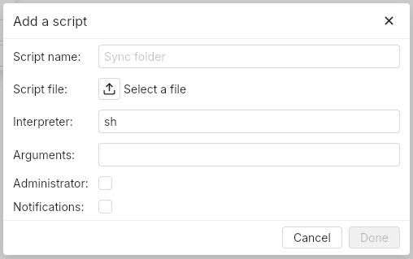
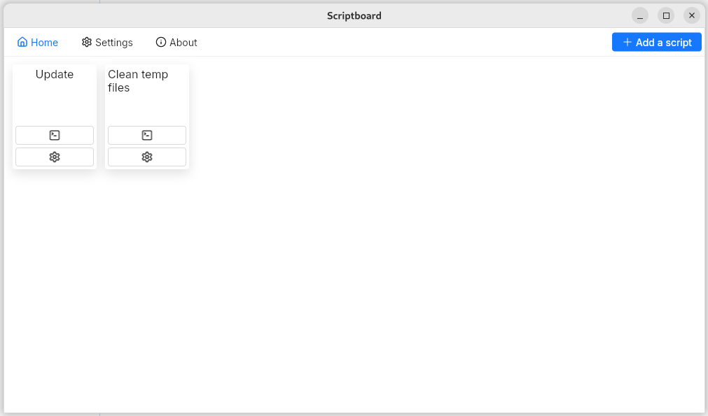

<p align="center">
	
</p>


A simple desktop software to execute saved script files on linux, macOS and windows.  
Idea from [@LotharieSlayer](https://github.com/LotharieSlayer).

> [!NOTE]
> The admin execution option is currently only available on Linux systems.

## How to use
> [!TIP]
> Feel free to scan Scriptboard with [Virustotal](https://www.virustotal.com/gui/home/upload).

### Download and install 
You can download Scriptboard from the [Releases page](https://github.com/uAtomicBoolean/scriptboard/releases).  
You can choose between downloading an installer or a portable executable to avoid having to install Scriptboard.  

> [!NOTE]
> **Macos:** You might get the following error "Scriptboard.app is damaged and cannot be opened".  
> To solve this, you can open the **Privacy & Security** settings and remove the quarantine from the **Security** section.  
> **Windows:** Scriptboard might be flagged as unsafe when starting it. You can ignore this warning by clicking **More info** and **Run anyway**.  

### Use  
Start by adding scripts by clicking on the `Add script` top-right button. This will open a modal in which you will be able to configure your script.  
Then, you only need to click on the script's card to execute it.  

<p align="center">
	
</p>

Some explanations about the script's settings:
- **Notification:** if checked, notifications will be sent in the application (no system notifications) when the script is done running.
- **Administrator:** if checked, Scriptboard will run the script with admin privileges, which might require the admin password.

## Development
- Clone the repo: `git clone https://github.com/uAtomicBoolean/sleek-ui.git`.
- Get the latest release of [sleek-ui](https://github.com/uAtomicBoolean/sleek-ui).
- Copy the `.env.example` file to a `.env` and set the env vars.
- Run `cargo run`.

**Get translatable strings on windows:**  
```powershell
$slintFiles = Get-ChildItem -Filter *.slint -Recurse | ForEach-Object { $_.FullName | Resolve-Path -Relative }
& "slint-tr-extractor" -o "MY_PROJECT.pot" $slintFiles
```

## Screenshots
<p align="center">
	
</p>